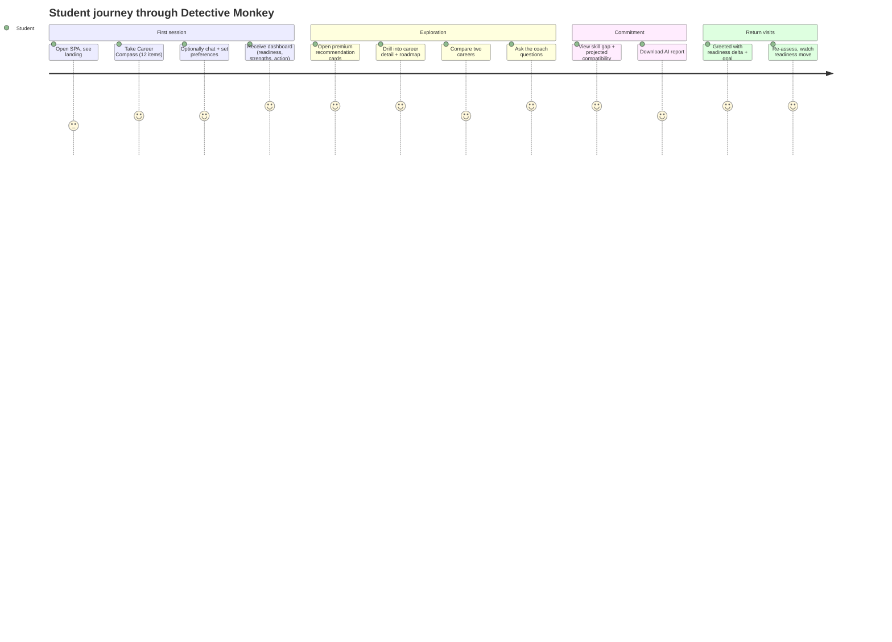

# Chapter 1 — Vision & Constitution

## 1.1 Executive summary

Detective Monkey answers one question for a student: **"given everything that
can honestly be known about me and about the world of work, what should I do
next?"** — and answers it in a way the student can interrogate. The system is
built around three commitments that shape every line of code:

1. **Evidence before inference.** Nothing is claimed about a student without a
   traceable chain: assessment response → validated evidence → derived signal →
   inferred trait → ranked recommendation → explanation. Every link carries
   provenance and confidence (`domain/common/provenance.py`,
   `domain/common/confidence.py`).
2. **Knowledge is generated, never curated.** The career knowledge base is a
   platform output, not a data-entry project: structured sources are fetched,
   normalized, entity-resolved, validated and written into a canonical
   Knowledge Graph; volatile facts (salaries, demand, visas) are retrieved and
   cached, never stored as truth (`knowledge/`, Chapter 5).
3. **The LLM explains; it does not know.** Language models are optional
   adapters. They narrate retrieved, validated context and expand knowledge
   *behind a validation gate*; they never fabricate a salary, a university, or
   a fit score. Remove the LLM and the product still works, deterministically.

The v2 codebase is a complete, runnable end-to-end implementation of this
vision with deliberately in-memory infrastructure: the domain, engines,
application services, knowledge platform, REST API and SPA are production-shaped;
persistence, auth, and observability are the scaffolding still to be swapped in
(Chapters 7–8 give the target design).

## 1.2 Product vision (Level 1 — Vision)

**For whom.** Students (initially secondary/tertiary, globally, with explicit
regional awareness — e.g. a student in Assam asking about data science) who face
a high-stakes, low-information decision and are underserved by generic career
quizzes and by unguided LLM chat.

**The wedge.** Existing tools fail in two opposite ways. Static assessments
(RIASEC quizzes, aptitude tests) are psychometrically grounded but produce a
one-shot PDF with no world model — no labour market, no regional reality, no
path. Raw LLM chat has a world model but no measurement, no calibration, no
consistency, and hallucinates the facts that matter most (salaries,
admissions, demand). Detective Monkey is the synthesis: **measured student ×
generated world knowledge × constrained reasoning**, delivered as an ongoing
mentor relationship (dashboard, readiness tracking, roadmaps, coach) rather
than a single report.

**Why now.** (a) LLMs make knowledge *generation* cheap enough that a
continuously self-building career knowledge base is feasible for the first
time; (b) public occupation taxonomies (O*NET, ESCO) provide the validated
skeleton to generate against; (c) the cost of hallucination in advice products
is now well understood, which makes a retrieval-first, validation-gated
architecture a defensible differentiator rather than an engineering nicety.

**Business value.** The knowledge platform is the moat: recommendations,
discovery, comparisons, regional advice and roadmaps are all *views over one
graph* that compounds with every generation run, while competitors re-pay the
curation cost per feature. The mentor loop (readiness history, goals, saved
careers — `InMemoryMentorMemory`) creates retention; the premium surfaces
(report, comparison, simulation) create monetization without touching the
truth layer.

## 1.3 The Software Constitution

These are the non-negotiable invariants. They are enforced today by code
structure and tests; any future change that violates one requires an ADR that
explicitly repeals it.

**Art. I — The domain is sovereign.** The domain layer
(`src/detective_monkey/domain/`) depends on nothing but the standard library.
Frameworks, databases, providers and transport are adapters behind ports
(`pyproject.toml` declares zero core dependencies; FastAPI/httpx are the `api`
extra). *Rationale:* the model of "student", "career" and "evidence" must
outlive every infrastructure choice. *Enforced by:* import direction, ADR 0001.

**Art. II — Immutability and versioning.** Every first-class object is a frozen
dataclass; state changes create new versions (`Version.next()`), and derived
objects pin the versions of their inputs (`VersionSet`). Historical outputs are
reproducible forever. *Enforced by:* `@dataclass(frozen=True, slots=True)`
everywhere; `test_invariants.py`.

**Art. III — Unknown over invented.** Missing data is `None`, never a default
0; unknown salary is reported as unknown; low-confidence knowledge is rejected
at the validation gate, not stored optimistically (`domain/common/scores.py`
docstring: "missing data never becomes fabricated data").

**Art. IV — One engine contract.** Every processing component implements
`BaseEngine` (`contracts/engine.py`): one `EngineRequest` in, one
`EngineResponse` out; errors are structured (`EngineErrorType`), never raised
across the boundary; success never depends on exceptions; every response
carries version, metrics, warnings, events, confidence and provenance.

**Art. V — The deterministic boundary.** The six intelligence layers are
Evidence → Knowledge → Inference → Decision → Explanation → Interaction
(`IntelligenceLayer`); everything up to and including Decision is
deterministic. LLMs may participate only above the boundary (Explanation,
Interaction) and in knowledge *generation* behind the validation pipeline.

**Art. VI — Retrieval before reasoning.** No AI component answers from its own
weights. Context is retrieved (graphs first, vectors as a supplement that never
overrides canonical knowledge), assembled into a deterministic, versioned
prompt, and only then narrated (`engines/retrieval/`, `knowledge/retrieval/`).

**Art. VII — Nothing untraceable.** Every derived value carries `Provenance`
(source type, references, timestamp); every trait carries `EvidenceItem`s;
every graph edge carries evidence references; every recommendation surfaces its
evidence in the UI.

**Art. VIII — Confidence is earned.** Confidence is a first-class explainable
quantity (`Confidence` with named `ConfidenceFactor`s) distinct from score, and
never increases without additional evidence (corroborating sources add
+0.1 each in `EntityMerger._confidence`; profile confidence blends
completeness, decisiveness, evidence count).

**Art. IX — Graceful degradation.** Provider failure returns empty output, and
the caller falls back to deterministic behaviour (`GeminiProvider.generate`
catches everything and returns `""`); an engine failure returns a structured
`FAILED` response; a missing source yields zero records, never an exception.

**Art. X — The code is the spec.** Module docstrings cite the governing design
document and section. Where this Bible and code disagree, code wins and the
Bible is amended.

⚠ **Review (constitutional gap):** the Constitution has no article about
*people* — no privacy, consent, data-retention or fairness invariant, despite
the system processing minors' psychometric data. Chapter 7 §7.5 and Chapter 8
propose Art. XI (Privacy by architecture) and Art. XII (Fairness &
calibration). This is the most consequential omission in the current design.

## 1.4 Core design principles (Level 1→2 bridge)

- **Guidance, not prediction.** Output language is calibrated: bands
  ("High", "Moderate") not false-precision percentages where the underlying
  measurement doesn't support them; the report footer says "guidance, not
  prediction" (`intelligence_service._render_report`). ⚠ Review: the UI still
  shows `score=87.3%`-style compatibility numbers derived from a 12-question
  assessment — Chapter 4 recommends surfacing confidence intervals instead.
- **Explainability as a feature, not a compliance patch.** Reasons, evidence
  chips, "missing information" and dimension scores are part of every
  recommendation object (`ranker.CareerRecommendation`), so the UI never has to
  reverse-engineer a justification.
- **Composition root over framework magic.** All wiring happens in one file
  (`application/container.py`); there is no DI framework, no globals, no
  service locator. A test can build a fully-functional backend in one line.
- **Ports are `Protocol`s.** Structural typing (`runtime_checkable Protocol`)
  keeps adapters swappable without inheritance coupling.
- **Configuration data over code.** The demo assessment, feature definitions,
  reasoning config and careers are *data* (`application/seed.py`), so a real
  deployment replaces content without touching engines.

## 1.5 Product philosophy (Level 2 — Product)

The product surface is a **mentor relationship**, sequenced as:

1. **Assess** — a 12-item Likert instrument (6 constructs × 2 items, one
   reverse-scored each; `seed._QUESTIONS`) plus optional free-text conversation
   and explicit preferences.
2. **Understand** — the AI dashboard: readiness ring, top strengths with
   evidence, learning style with a "why", the single biggest opportunity, and
   "today's action" — one concrete next step, because agency beats information.
3. **Explore** — premium career cards (why · evidence · salary · demand ·
   automation risk · skill gaps · next actions), career detail pages, related
   careers, comparison, discovery queries.
4. **Plan** — roadmaps ordered by prerequisite difficulty, skill-gap analysis
   with projected compatibility gains, downloadable report.
5. **Return** — the persistent mentor greets a returning student with readiness
   movement and the goal they were exploring (`InMemoryMentorMemory`), turning
   a report into a relationship.

Philosophical commitments visible in the copy and mechanics: **strengths-first
framing** (weaknesses appear as "challenges" and growth levers, never as
verdicts), **one action at a time**, **honesty about uncertainty** ("Limited
assessment data — confidence is low" is shipped to the UI as
`missing_information`), and **the student owns the pace** (nothing is gated on
completing everything).

## 1.6 User journey (Level 2, end-to-end)

Each step's full technical trace is Chapter 2; each screen's data contract is
Chapter 6.

## 1.7 Design Review — vision & constitution

**What is right.** The constitution is real, not aspirational: import
direction, frozen dataclasses, the engine contract and the provider-fallback
pattern are all mechanically present and tested. The three commitments
(evidence-first, generated knowledge, constrained LLM) are the correct bets
for an advice product in 2026 and are *architecturally* enforced rather than
policy-enforced — the strongest form of enforcement.

**Findings and recommendations** (full analysis in Chapter 8):

| ID | Finding | Recommendation |
|----|---------|----------------|
| C-1 | No privacy/consent/fairness articles despite minors' psychometric data | Add Art. XI (privacy by architecture: per-student encryption scope, retention windows, export/delete as first-class use cases) and Art. XII (fairness: demographic-blind ranking inputs, calibration monitoring). **P0.** |
| C-2 | "Guidance, not prediction" is under-enforced: precise compatibility percentages from a 12-item instrument overstate measurement precision | Ship score *bands with confidence intervals*; keep raw scores internal for ranking. **P1.** |
| C-3 | The constitution lives in scattered docstrings + this Bible | Encode as executable checks: an import-linter contract for Art. I, a CI test that greps for naked `except`/mutable domain fields, a determinism replay test for Art. V. **P2.** |
| C-4 | Two reasoning stacks (P2 Recommendation Engine vs Intelligence-v1 ranker) both claim to be "the" scorer | Constitutionally name one decision path; keep the other as a match-engine plugin. See Ch. 4 finding E-1. **P1.** |
