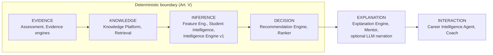
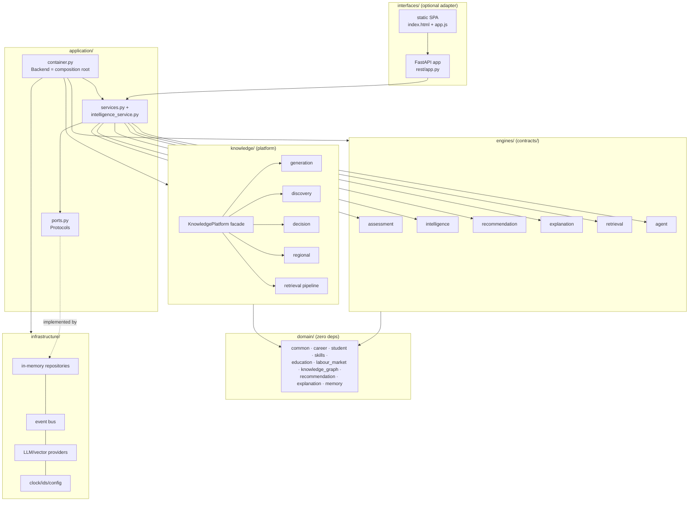
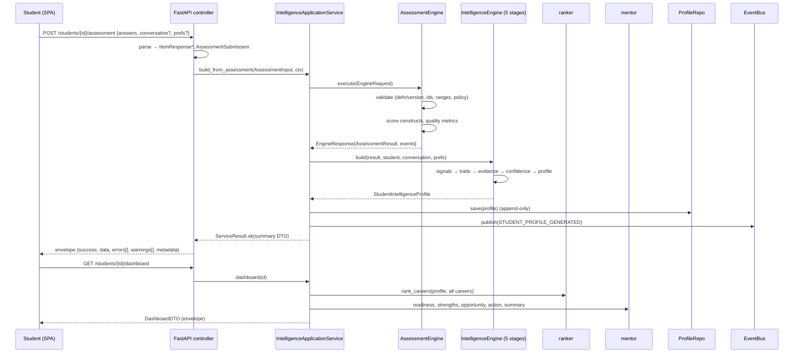

# Chapter 2 — Complete System Walkthrough

This chapter traces the **complete life of the system**: every object created,
every transformation applied, every decision taken, from the moment a student
opens the application to the moment analytics could learn from the outcome.
It is the "spine" chapter — Chapters 3–7 are deep dives into segments of the
trace given here.

## 2.1 The six-layer intelligence architecture (Level 3 — System)

Every computation in Detective Monkey belongs to exactly one layer of the Core
Intelligence Architecture (`contracts/engine.py::IntelligenceLayer`):

The layers are not processes or services — they are a *typing discipline*:
each engine declares its layer in `EngineMetadata`, and the layer determines
whether nondeterminism (an LLM) may participate. Data flows left-to-right
through immutable objects; no layer reaches backward.

## 2.2 Static structure

Dependency rules (checked by import direction): `domain` imports nothing;
`contracts` and `engines` import `domain`; `application` imports both plus
`knowledge`; `infrastructure` implements `application.ports`; `interfaces`
imports `application` only. `knowledge` imports `domain` + `application.ports`
(ports only — never services), which keeps it a peer of `engines`, not a
dependent.

## 2.3 The complete life of a first session

The canonical trace. Steps are numbered; **[obj]** marks each object created.

### Step 0 — Process start

`uvicorn detective_monkey.interfaces.rest.asgi:app` → `create_app()`
(`interfaces/rest/app.py`). If no `Backend` is injected, `seed.build_demo_backend()`
constructs the entire platform: **[Backend]** wires clock, id generator, env
config, event bus, nine repositories, vector index, providers (Gemini if
`GEMINI_API_KEY` is set, else `TemplateLLMProvider`), ten engines, five
application services, the Intelligence application service, and the
**[KnowledgePlatform]** (sharing the same graph repository, clock, event bus
and LLM). Seed data loads the assessment definition, feature definitions,
reasoning config, demo careers with personality requirements and skills, career
insights, and knowledge nodes for retrieval. The SPA is mounted last so `/api`
routes win. Everything lives in one process, in memory — **⚠ Review:** a
restart erases all students (finding O-1, Chapter 7).

### Step 1 — User opens the application

Browser GETs `/` → StaticFiles serves `index.html` (40 lines) and `app.js`
(335 lines, no framework, no build step). The SPA generates/loads a student id
in `localStorage`, fetches `GET /api/v1/assessments/default`, and renders the
questionnaire from the serialized `AssessmentDefinition` — the frontend owns
zero question content; the instrument is entirely backend-versioned data
(**[AssessmentDefinition]**, id `career-compass-v1`, `Version(1)`).

### Step 2 — Submission → Evidence (EVIDENCE layer)

`POST /api/v1/students/{id}/assessment` with
`{answers: [{question_id, value, duration_ms}], conversation?, preferences?}`.

1. The controller parses answers into **[ItemResponse]** tuples (malformed →
   envelope error `VALIDATION_ERROR`, HTTP 4xx — no exception crosses the
   boundary), builds **[AssessmentSubmission]** pinning the definition id *and
   version* (INV: a submission can never be scored against a drifted
   instrument), optional **[ConversationContext]** and **[StudentPreferences]**.
2. `IntelligenceApplicationService.build_from_assessment` creates
   **[IntelligenceContext]** (correlation id, request id, timestamp) and calls
   `AssessmentEngine.execute(EngineRequest(ctx, AssessmentInput(defn, submission)))`.
3. `AssessmentEngine.validate` checks: definition/version match, unknown
   question ids, duplicates, scale-range violations, missing-policy. Any error
   → structured `FAILED` response, never an exception.
4. `_run` scores each response: reverse-scored items are flipped
   (`value' = max+min−value`), values normalize to 0–100 per construct, means
   aggregate per construct; response-time screening flags speeding
   (< 800 ms/item) into **[QualityMetrics]** (completion, consistency,
   speeding). Each construct observation becomes **[Evidence]** with
   deterministic ids (reproducible: same submission → same evidence ids),
   `Provenance(ASSESSMENT)`, per-item confidence, and
   `metadata={kind: construct_observation, value}`. Output:
   **[AssessmentResult]** (evidence tuple + quality) plus `ASSESSMENT_COMPLETED`
   events on the response.

### Step 3 — Reasoning → Profile (INFERENCE layer)

`IntelligenceEngine.build(assessment, student, conversation, preferences)` —
the *single reasoning component* — runs five deterministic stages
(`engines/intelligence/`):

1. **Signal extraction** (`signals.py`): construct evidence → normalized
   **[StudentSignals]** vector of 11 signals. Direct mappings (analytical→
   logical, creativity→creative, …); composites by documented means
   (social = mean(verbal, leadership); technical = 0.6·logical, boosted to
   ≥ 0.75 by word-boundary technical keywords in conversation). Missing
   construct → neutral 0.5, never 0 (Art. III).
2. **Trait inference** (`reasoner.py`): thresholds STRONG ≥ 0.66 / WEAK ≤ 0.40
   split signals into **[Trait]** strengths/weaknesses; five interest areas
   score as weighted signal sums (e.g. Programming & Technology =
   0.6·technical + 0.4·logical) forming the **[career Vector]**; a Big-Five-ish
   personality tuple; argmax learning style and work environment; an
   8-component **[skill Vector]**; preferences → **[CareerConstraints]**.
3. **Evidence collection**: every trait carries **[EvidenceItem]**s
   (claim/source/detail/weight/confidence); conversation adds a "Stated
   interests" item at weight 0.5.
4. **Confidence estimation** (`confidence.py`):
   `0.4·completeness + 0.3·decisiveness + 0.3·min(1, evidence/8)` where
   decisiveness = mean |signal − 0.5|·2. A half-empty, all-neutral submission
   scores low — honesty is computed, not asserted.
5. **Profile construction** (`builder.py`): everything assembles into the
   immutable **[StudentIntelligenceProfile]** (intelligence-layer variant) with
   **[ProfileMetadata]** (engine version, counts, completeness).

The service persists the profile (append-only per student), records readiness
into mentor memory, publishes **[DomainEvent STUDENT_PROFILE_GENERATED]** with
the correlation id, and returns the summary DTO through the envelope.

### Step 4 — Ranking (DECISION layer)

Any recommendation-bearing endpoint calls
`rank_careers(profile, careers.list_all())` (`engines/intelligence/ranker.py`):
for each **[Career]** aggregate, five dimension scores —
personality (distance from each requirement's optimal `ScoreRange`, weighted
by `Importance`), interest (career-name keywords → interest area → career
vector affinity), skill (technical-aptitude gate over required skills),
learning-style and constraints (both currently neutral extension points) —
combine under `RankingWeights` (personality .30, interest .25, skill .25,
style .10, constraints .10, normalized) plus a labour-market bonus that
*adjusts but never dominates* (additive, capped). Output per career:
**[CareerRecommendation]** with score (0–100), confidence
(profile confidence × personality-data factor), reasons, matching skills,
evidence, missing-information notices and per-dimension scores. Sort:
(−score, −confidence, career_id) — fully deterministic. ⚠ Review: the skill
matcher is a single-signal gate and the neutral dimensions dilute real signal
(findings E-2, E-3, Chapter 4).

### Step 5 — Explanation & mentor surfaces (EXPLANATION layer)

`mentor.py` derives every premium surface deterministically from
(profile, matches, insights): readiness score with increase/decrease levers;
AI summary; biggest opportunity (highest employability-gain skill across top
matches); today's action; roadmaps (insight steps + status from profile);
skill gaps with projected compatibility; comparisons with per-dimension
winners; coach replies that wrap the agent's grounded answer in
profile-aware framing plus suggested questions. Where an LLM is configured,
the Explanation Engine renders its deterministic **[PromptPackage]** through
it; where not, the template renders the same package (Art. IX).

### Step 6 — Conversation (INTERACTION layer)

`POST /api/v1/conversations` → `CareerIntelligenceAgent`: classify intent
(rule table, first match wins) → capability (explain / recommend /
retrieve-and-answer) → for retrieval: `KnowledgeRetrievalEngine` assembles a
**[ContextPackage]** (decision > knowledge > evidence > memory > vector
priority; relevance = token overlap; dedupe; budget 12) and a versioned
**[RetrievalPromptPackage]** whose system prompt forbids contradicting the
graphs → optional LLM narrates → the coach personalizes. Missing prerequisites
→ the agent asks a clarifying question rather than speculating.

### Step 7 — Knowledge questions (KNOWLEDGE layer, Chapter 5)

`KnowledgePlatform.ask(query)` runs intent detection → graph search → BFS
expansion → dynamic-fact retrieval (TTL-cached, negative-cached) → reasoning
(LLM or deterministic composition). Discovery, decision-support and regional
services are structured variants of the same retrieve-first pattern.

### Step 8 — Caching, persistence, analytics, learning

- **Caching:** `KnowledgeCache` (namespaced keys, clock-injected TTL) holds
  dynamic facts and generated comparisons/regional advice.
- **Persistence:** all repositories are in-memory dicts; immutable aggregates
  are append-only. The ports are the contract Postgres/Neo4j adapters will
  implement (Chapter 8 migration plan).
- **Analytics:** every state transition publishes a **[DomainEvent]** (unique
  event id, aggregate, correlation/causation ids) on the bus with retry + DLQ.
  Today there are no analytics subscribers — the *stream exists, the sink
  doesn't* (finding O-3).
- **Future learning:** recommendation acceptance/rejection events are defined
  (`RECOMMENDATION_ACCEPTED/REJECTED`) but nothing consumes them yet; the
  learning loop is designed-for but unbuilt (Chapter 9 §9.6).

## 2.4 Sequence diagram — assessment to dashboard

## 2.5 Design Review — the walkthrough

**What is right.** The trace is *linear and total*: every arrow above is a
typed, immutable object; there is no hidden state, no side channel, and the
correlation id threads the entire request. Replaying a submission reproduces
the profile bit-for-bit — the reproducibility promise is real.

**Findings** (consolidated in Chapter 8):

| ID | Finding | Recommendation |
|----|---------|----------------|
| W-1 | Every read endpoint re-ranks all careers (`_matches()` on each dashboard/detail/compare call) — O(careers) per request, recomputed | Cache ranked matches per (profile version, catalog version); invalidate on profile save. Trivial with the existing `KnowledgeCache`. **P2.** |
| W-2 | The two knowledge stores (seeded `demo_knowledge_nodes` for the agent vs the Knowledge Platform graph) are separate — the coach doesn't see generated knowledge | Point `RetrievalInput.knowledge_nodes` at `knowledge_graph.list_nodes()`; delete the parallel seed path. **P1.** |
| W-3 | `POST` and `GET /recommendations` both *recompute*; GET is not idempotent-by-storage and nothing persists the P2 `Recommendation` aggregate in this flow | Persist ranked output as the immutable Recommendation aggregate (the repo already exists) and serve GETs from it. **P1.** |
| W-4 | No request authentication: any caller can read any student's profile by path parameter | Chapter 6 §6.6 design. **P0.** |
