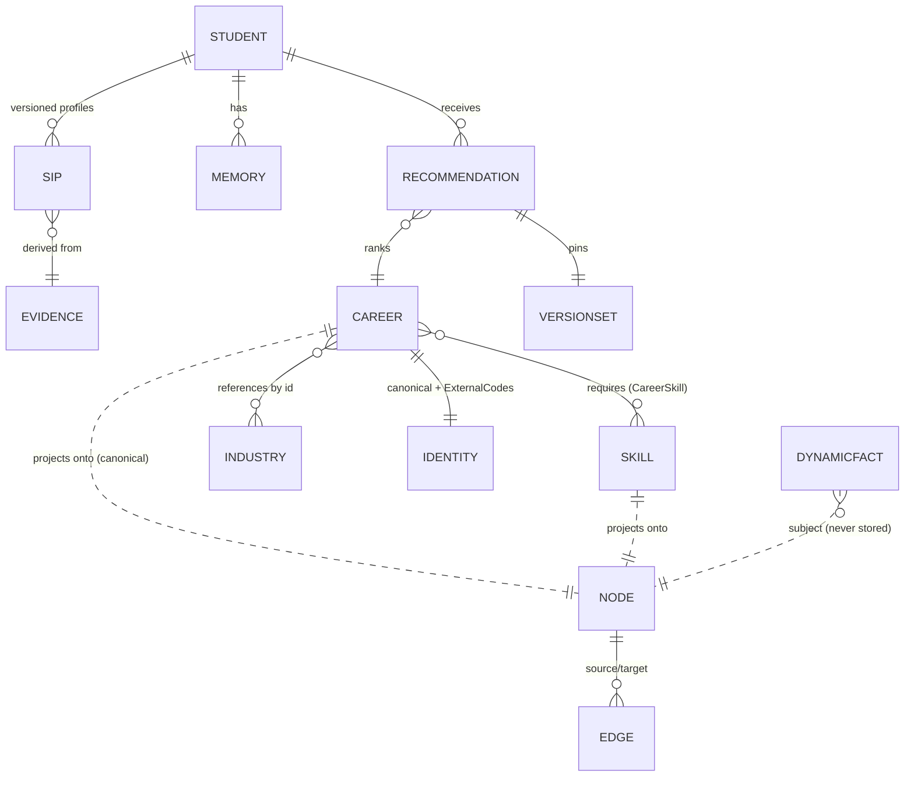

# Chapter 3 — The Domain Model

The domain layer (`src/detective_monkey/domain/`) is the sovereign core: pure
stdlib, immutable, versioned, and organized by bounded subdomain. This chapter
documents every model family with the required lifecycle facets — why it
exists, who creates it, who owns it, how it changes, how it is validated,
persisted and destroyed, its relationships, versioning and extensibility — and
closes with the design review.

## 3.1 The common vocabulary (`domain/common/`)

These value objects are the *type system of trust*. Every other model is built
from them.

### Identifiers (`identifiers.py`)

`EntityId` — opaque, immutable, non-empty string; subclassed per entity
(`StudentId`, `CareerId`, `SkillId`, `NodeId`, `EdgeId`, … 18 total) so a
`StudentId` can never be passed where a `CareerId` is expected (type-level
prevention of the most common cross-aggregate bug). `generate()` prefixes a
uuid4 hex with the lowercase type name; the domain never assumes a storage
engine mints ids. **Created by:** whoever creates the entity. **Destroyed:**
never — ids are eternal references even after archival.
**⚠ Review (D-1):** the Knowledge Platform mints *deterministic* ids
(`node_{type}_{slug}`) through the same `NodeId` type — correct and idempotent,
but the two minting disciplines (random vs content-derived) should be named in
code; recommendation: a `ContentAddressedId` marker or a documented factory
per discipline.

### Versioning (`versioning.py`)

`Version(number ≥ 1, label)` — monotonic, append-only (`next()`), ordered.
`VersionRef`/`VersionSet` — a derived object pins the exact input versions it
was computed from (a Recommendation pins profile, career, knowledge,
labour-market, engine and weight-config versions). This is the reproducibility
spine: any historical output can be re-derived by loading the pinned versions.
**How it changes:** never in place; a new state is a new `Version`.

### Provenance (`provenance.py`)

`Provenance(source: SourceType, description, references, recorded_at)` — the
answer to "where did this come from?". `SourceType` is a closed enum of 17
origins (assessment, academic record, government statistics, derived, system,
…). `references` are opaque strings (evidence ids, dataset URIs) to stay
storage-agnostic. Every derived feature, node, fact and recommendation carries
one (Art. VII).

### Confidence (`confidence.py`) and scores (`scores.py`)

`Confidence(value: UnitInterval, factors: ConfidenceFactor*)` — explainable:
the factors say *why* confidence is what it is. Confidence ≠ score: a career
can fit strongly (high score) while the system is unsure (low confidence).
`Score` [0,100], `UnitInterval` [0,1], `ScoreRange` (personality optimal
bands), `ProficiencyLevel` (0 = NO_EVIDENCE distinct from zero ability),
`Importance`, `Trend`. Range invariants raise at construction — an invalid
score cannot exist.

### Attributes, events, evidence

`Attributes` — immutable string map as a tuple of pairs (hashable, safe inside
frozen objects, unique keys enforced). `DomainEvent` — immutable record with
event id, aggregate type/id, schema version, correlation/causation ids and an
`Attributes` payload; `EventName` is the closed catalogue (≈50 names across 12
groups). `Evidence` — id, subject, provenance, confidence: the atomic unit of
the Evidence layer.

## 3.2 The Career aggregate (`domain/career/`)

**Why it exists.** A career is the unit of recommendation and knowledge — a
*graph of reusable layers*, not a flat record, so it can grow to 100+
attributes without redesign.

**Shape.** `Career` = `CareerIdentity` (canonical name, slug, aliases,
`ExternalCodes` for ISCO/O*NET/ESCO/SOC — multi-taxonomy alignment without
privileging one) + optional layers: `CareerSkill` requirements (referencing
canonical `SkillId`s, never embedding), knowledge areas, subjects,
competencies; personality requirements (construct + optimal `ScoreRange` +
importance), work values/styles, responsibilities; technologies, tools,
certifications; industry and education-pathway *references by id*; progression
paths; and the metadata block (status, verification status, quality/coverage
scores, provenance, version).

**Deliberate exclusions:** salary and labour-market data are *not* fields —
they live in the Labour Market model / Dynamic Knowledge keyed by `CareerId`
("do not store salary inside Career"). This is the domain-level enforcement of
the static/dynamic knowledge split (Chapter 5 §5.8).

**Lifecycle.** Created by seed data today and by the Knowledge Platform's
generation loop tomorrow (Chapter 8 M-3 unifies them); owned by the knowledge
domain (careers contain no student data — INV); changed only by producing a
new `Version`; validated at construction (non-empty identity) and by the
knowledge validation pipeline when platform-generated; persisted via
`CareerCatalogRepository` (read-optimized port); never destroyed — status
moves DRAFT → PUBLISHED → DEPRECATED → ARCHIVED.

## 3.3 The Student subdomain (`domain/student/`, `domain/memory/`)

`Student` — a thin identity root (the platform deliberately stores *evidence
about* students rather than rich student state). The raw
`StudentIntelligenceProfile` (domain variant) holds versioned construct/domain
scores with `DerivedFeature`s that **must** reference evidence (constructor
raises otherwise — Art. VII is enforced in the type). `StudentGoals`,
timeline, reliability scores support the mentor loop. `Memory` records
(typed, importance-weighted, provenance-carrying) feed retrieval.

Note the *two* profile types: the domain SIP (raw scores, append-only
versions, `ProfileRepository`) and the intelligence-layer profile (interpreted
traits/vectors, `InMemoryIntelligenceProfileRepository`). They are different
aggregates at different abstraction levels feeding different consumers.
**⚠ Review (D-2):** the name collision (`StudentIntelligenceProfile` twice) is
a real hazard — imports have already needed aliasing. Rename the
intelligence-layer object `InterpretedProfile` (or `StudentPortrait`). **P2.**

## 3.4 Knowledge Graph primitives (`domain/knowledge_graph/`)

`Node` — one concept, one node (INV-01): id, `NodeType` (23 canonical types),
canonical name + aliases + semantic tags, description, status, verification
status (PROVISIONAL → VERIFIED / DISPUTED / DEPRECATED), quality/coverage
scores, provenance, metadata, version. `Edge` — first-class, versioned
relationship: `RelationshipType` (21 semantic types — edges never exist
without meaning), direction, optional strength/weight (absent ≠ zero, Art.
III), confidence, evidence references. Self-loops are unconstructible.
The ontology (`ontology.py`) is the single place new node/edge types are
added — additive evolution without contract changes.

**Lifecycle.** Created by the Knowledge Platform's assembler (idempotent
upserts, content-addressed ids); owned by the knowledge domain; changed by
re-generation (version bump); validated by the platform's pipeline *before*
write (only validated knowledge enters — Chapter 5); persisted via
`KnowledgeGraphRepository`; deprecated, never deleted.

## 3.5 Supporting subdomains

- **skills/** — canonical `Skill` + taxonomy, `CareerSkill` (career-side
  requirement with proficiency/importance), `StudentSkill` (evidence-based),
  `SkillGap`, skill relationships.
- **education/** — institutions, qualifications, pathways, competencies,
  requirements, student education records.
- **labour_market/** — `LabourMarketSnapshot` (versioned, dated), salary
  structures, demand metrics, AI-impact scores. Snapshots are the *static*
  representation; the Knowledge Platform's `DynamicFact` is the *retrieved*
  representation (Chapter 5 reconciles them).
- **recommendation/** — the immutable `Recommendation` aggregate (dimension
  scores, evidence, alternatives, pinned `VersionSet`), `WeightConfiguration`
  (versioned weights — tuning is data), warnings with severities.
- **explanation/** — the Explanation object with decision-graph references.

## 3.6 Entity relationships

## 3.7 Design Review — domain model

**What is right.** This is a textbook tactical-DDD core executed with unusual
discipline: invariants in constructors, absence modeled as `None` (not zero),
typed ids, provenance and confidence as *types* rather than columns, and the
static/dynamic knowledge split enforced at the aggregate boundary. The
decision to keep the domain stdlib-only (ADR 0001) was correct: it makes the
whole platform testable in milliseconds and portable to any runtime.

**Findings.**

| ID | Finding | Analysis & recommendation |
|----|---------|---------------------------|
| D-1 | Two id-minting disciplines share one type | See §3.1. Cosmetic but trust-relevant: content-addressed ids are a *guarantee*, random ids are not. Name the guarantee. **P3.** |
| D-2 | `StudentIntelligenceProfile` name collision across layers | Rename the interpreted profile. **P2.** |
| D-3 | `Attributes` is stringly-typed (`str→str`); numeric metadata (difficulty, salary bounds) round-trips through strings | Acceptable for open metadata; wrong for load-bearing values. Where a value participates in an algorithm (difficulty ordering, salary comparison), promote it to a typed field on a model. Alternative considered: `Attributes[str, str|float]` union — rejected: destroys hashability guarantees and invites `Any` creep. **P2.** |
| D-4 | Frozen dataclass "update" requires hand-copied constructors (`GraphAssembler._reversioned`, `_with_description` re-list every field) | Adopt `dataclasses.replace()` uniformly; it preserves immutability with one line and eliminates the drift risk when fields are added. **P2, mechanical.** |
| D-5 | `Provenance.references` as bare strings can't distinguish reference kinds (evidence id vs dataset URI vs source id) | Introduce a `Reference(kind, value)` VO when the audit UI is built; premature before then. **P3.** |
| D-6 | No aggregate for consent/data-subject records | Required by C-1 (Art. XI). Add a `Consent` aggregate (student id, scope, granted/revoked timestamps, versioned policy id) before any real student data exists. **P0 with auth.** |
