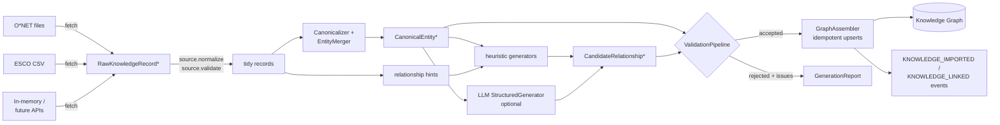

# Chapter 5 — The Knowledge Platform

The Knowledge Platform (`src/detective_monkey/knowledge/`, ADR 0002) is the
system's answer to the fatal flaw of every career product before it: the
knowledge base as a manual curation project. Here, knowledge is **generated,
normalized, validated, stored, reused** — and the platform is the *single
source of truth* for the recommendation, discovery, mentor, decision and
roadmap features. This chapter covers every required knowledge topic:
acquisition, normalization, entity resolution, validation, conflict
resolution, the graph, generation, retrieval, provenance, versioning,
dynamic vs static knowledge, regional/country/university/labour/salary
intelligence, and caching.

## 5.1 The three layers (why the architecture is shaped this way)

| Layer | Volatility | Where it lives | Never |
|---|---|---|---|
| **Core** (careers, skills, industries, relationships, learning paths) | changes slowly | Knowledge Graph, permanently, versioned | manually mass-created |
| **Dynamic** (salary, demand, trends, AI disruption, visas, scholarships, universities, company hiring, remote, regional demand — `DynamicFactType`) | changes weekly/daily | `DynamicFact`s fetched via provider ports, TTL-cached (`DEFAULT_FACT_TTL` per type: hiring 1d … universities 90d) | stored as permanent truth |
| **Personalized** (fit reasoning, comparisons, regional advice, roadmaps) | per request | generated from profile + core + dynamic; cached briefly (6h–7d) | persisted as truth |

The layer split is enforced *in the types*: `CanonicalEntity` refuses
construction with a non-CORE layer; `DynamicFact` carries `as_of` +
`ttl_seconds` and lives only in the cache; personalized outputs are DTO-like
frozen results with no repository.

## 5.2 Knowledge acquisition pipeline

**Sources** implement one interface — `fetch/normalize/validate/metadata` —
and carry a **reliability score** used for confidence and conflict
resolution. The generic `DelimitedFileSource` maps column names in its
constructor; `ONetOccupationSource` and `EscoOccupationSource` are presets
over the real column layouts of those exports (tab-delimited SOC/Title/
Description; ESCO preferredLabel/altLabels newline-separated). A missing file
yields zero records (Art. IX). Source-level validation drops structurally
unusable rows (empty names, intra-source duplicates); platform-level
validation judges the merged result.

## 5.3 Normalization & entity resolution

Resolution is deterministic and three-staged (`Canonicalizer.resolve`):
1. **Alias table** — explicit alias→canonical mapping (seeded with career
   synonym families, extended at runtime; every merge teaches it).
2. **Slug identity** — exact match on the stable slug.
3. **Conservative fuzzy** — token-set Jaccard ≥ 0.75 against known canonicals
   ("Engineer, Software" ≈ "Software Engineer"); on match, the alias is
   *recorded*, so the fuzzy path self-converts into the explicit path.

`EntityMerger` then folds all records resolving to one identity: longest
description wins; names/aliases union (canonical name excluded from its own
aliases); tags/codes union; first-writer-wins per attribute key (conflicts
are separately *reported*, §5.4); confidence = max source reliability
+0.1 per corroborating source (cap +0.2) with named factors — Art. VIII
mechanically applied; provenance references every contributing source.

**Complexity:** O(records) grouping + O(known canonicals) per fuzzy lookup.
⚠ **K-4:** the fuzzy scan is O(N) per new name — fine at 10³ entities, wrong
at 10⁵. Superior: token-signature blocking (index canonicals by rare tokens;
compare only within blocks) — standard entity-resolution practice
(Fellegi–Sunter framing; blocking from record-linkage literature), stdlib-
implementable. **P2, triggered by scale.**

**Research view.** This is deterministic entity resolution with an evolving
synonym dictionary — the right *first* system: explainable, idempotent, no
training data needed. The literature's next steps, in order of value:
supervised pairwise matchers (Magellan), embedding-based blocking (Ditto),
and collective resolution over the graph (relationships as evidence for
identity). All slot behind `Canonicalizer.resolve`'s signature.

## 5.4 Validation & conflict resolution

`ValidationPipeline` is the write gate; ERROR rejects, WARNING flags:

- **Entities:** provenance present (nothing untraceable); slug/name
  consistency; no self-aliases; description length bounds; confidence present
  and ≥ threshold (default 0.3 — a 0.1-reliability rumor source is rejected,
  tested); cross-batch duplicate detection (a duplicate reaching validation
  means normalization failed — it is an ERROR, not a merge).
- **Conflicts:** attribute keys where sources disagree are reported as
  WARNINGs with the disagreeing values (`check_conflicts`) while the merge
  keeps the higher-reliability value — *knowledge stays available, curation
  gets a queue.* ⚠ **K-5:** resolution is first-writer/reliability-max, and
  the losing value is discarded rather than stored as a disputed variant.
  Superior: keep contested values as metadata (`disputed:{key}` entries) so
  the graph can express disagreement (the `DISPUTED` verification status
  already exists but nothing sets it). **P2.**
- **Relationships:** deduped by (type, source, target); self-loops rejected;
  **unknown endpoints rejected** — the platform never links to invented
  entities (this is the LLM containment backstop); typed endpoint rules for
  semantically-directional edges (LOCATED_IN targets countries/regions, …).

## 5.5 The graph: construction & traversal

**Construction (`GraphAssembler`).** Content-addressed identity is the load-
bearing idea: `node_{type}_{slug}` and `edge_{type}_{source}__{target}` make
every generation run an **idempotent upsert** — re-ingesting updates nodes
(version bump, tested) instead of duplicating. Name→id resolution prefers ids
already in the graph (authoritative even for foreign nodes), then computed
entity ids. Every write publishes a domain event.

**Traversal (`GraphTraversal`).** Read-only: name/alias lookup; token-overlap
search; filtered neighbours (node-type and relationship-type frozensets);
BFS `expand` with depth/limit returning a `Subgraph` (nodes + connecting
edges); BFS shortest `find_path`. Deterministic ordering everywhere
(sorted by name/id) so retrieval, discovery and prompts are reproducible.

⚠ **K-1 (the platform's headline finding): every traversal primitive scans
`list_nodes()`/`edges_of` linearly** — O(V) name lookups, O(V·T) search,
O(depth·frontier·E) expansion against an edge scan. Correct at demo scale;
unusable at O*NET scale (~10³ occupations, ~10⁴ skills, ~10⁶ edges).
**Resolution is an adapter, not a rewrite** — this is the payoff of the ports
design: (1) *now*: index the in-memory repo (name/alias→id dict, adjacency
list, inverted token index) — O(1)/O(query tokens) lookups, ~50 lines, no
interface change; (2) *at scale*: a Neo4j/SQLite-graph adapter behind the same
`KnowledgeGraphRepository` port. Alternatives: materialized closure tables —
rejected (write amplification under continuous regeneration); RDF/SPARQL —
rejected (ontology is intentionally small and closed; SPARQL's generality
isn't needed). **P1.**

## 5.6 Knowledge generation

**Deterministic generators** (always on): source hints → candidates (resolved
through the canonicalizer, so hints about "Programmer" land on "Software
Engineer" — tested); **related-careers** via shared-REQUIRES Jaccard ≥ 0.4
with strength = overlap; **industry mappings** from declared attributes/tags;
**learning paths** by difficulty-then-name ordering (unknown difficulty sorts
*middle*, not easy — Art. III); deterministic summaries.

**LLM generation** (`StructuredGenerator`, optional): description enrichment
(shape-checked: 30–2000 chars, non-JSON) and relationship proposals — parsed
strictly from a JSON array, restricted to a six-type whitelist, endpoints must
be *already-known* entities, then run through the full validation pipeline at
0.5 confidence (unverified until corroborated). The test suite proves an
invented entity and an invented relationship type are both dropped.
`enrich_missing()` targets sparse descriptions and under-connected nodes —
the continuous-improvement pass, background-job shaped.

**⚠ K-6:** enrichment marks LLM descriptions `DERIVED` but the node's
`verification_status` stays PROVISIONAL forever; nothing ever promotes to
VERIFIED. Add a promotion rule (N corroborating sources or human review event)
so the status field carries information. **P2.**

## 5.7 Retrieval pipeline

`question → intent (rule table) → graph search (seeds ≤ 5) → BFS expand
(depth 1) → dynamic facts (per requested fact types × ≤ 3 subjects, cached,
negative-cached 300 s) → reasoning`. The LLM, when present, narrates over a
deterministic prompt whose system message prohibits invention and demands
"insufficient facts" admissions; when absent, a deterministic composition of
retrieved content answers. Confidence = f(seed coverage, fact freshness) with
named factors; provenance references every node and fact used. An empty graph
yields an explicit "no canonical knowledge matched" — **unknown over
invented**, tested.

Regional questions resolve by *retrieval*: region extracted by matching known
COUNTRY/REGION nodes (word-boundary, longest match), facts fetched per
(subject, type, region) with graceful fallback to global facts — no
Career × Country materialization ever.

## 5.8 Dynamic knowledge, caching, and the intelligence services

`DynamicKnowledgeProvider` is the Layer-2 port (static seeded adapter and
composite fan-out today; salary/job APIs tomorrow). `KnowledgeCache`:
namespaced keys, clock-injected TTL (tested with a fake clock), prefix
invalidation, hit/miss stats, `get_or_compute`. **Regional intelligence**
(advice per career × location from regional facts, cached 7d),
**decision support** (comparison matrices per option × criterion; unknown
cells say "no current data"; deterministic profile-aware closest-match when
no LLM), and **discovery** (facet extraction with negation — "careers
*without* programming"; related/alternative/hidden/emerging careers and
families purely by traversal) are all views over the same retrieve-first
machinery. **Salary/labour intelligence** = SALARY/DEMAND/REGIONAL_DEMAND
fact types + the domain's versioned `LabourMarketSnapshot` for historical
series. ⚠ **K-7:** snapshots and DynamicFacts are unreconciled twins — define
DynamicFact as the *retrieval view* and snapshots as the *persisted history*,
with a subscriber materializing facts→snapshots. **P2.**

## 5.9 Provenance & versioning of knowledge

Every entity: provenance referencing contributing sources; confidence with
factors; version starting at `Version(1,"generated")` and bumping on
regeneration ("regenerated") or enrichment ("enriched"). Every edge:
versioned, confidence-carrying, evidence-referencing. Every generation run:
a `GenerationReport` (counts + every validation issue) — the audit trail of
knowledge growth. Rejected knowledge is *reported*, never silently dropped.

## 5.10 Design Review — knowledge platform

**What is right.** The platform is the strongest subsystem in the codebase:
the generate→normalize→validate→store loop is real and tested end-to-end;
idempotency via content-addressed ids is the correct foundation for
*continuous* generation; LLM containment is defense-in-depth (whitelist +
known-entities + validation + confidence discount); and the layer split is
enforced by types rather than convention.

| ID | Finding | Recommendation |
|----|---------|----------------|
| K-1 | O(N) traversal/search over repo scans | Indexed in-memory adapter now; graph-DB adapter at scale. **P1** |
| K-2 | Retrieval recall limited by token overlap | Alias expansion → BM25 → vector supplement, in that order (Ch. 4 §4.7). **P1–P2** |
| K-3 | Generation runs synchronously in-process; "background jobs" are shaped but unscheduled | Add a scheduler + job runner (Ch. 7 §7.4); generation must never block a request. **P1** |
| K-4 | Fuzzy resolution scans all canonicals | Token blocking. **P2** |
| K-5 | Conflict losers discarded; DISPUTED never set | Disputed-variant metadata + status wiring. **P2** |
| K-6 | No verification promotion path | Corroboration/human-review promotion rule. **P2** |
| K-7 | DynamicFact vs LabourMarketSnapshot unreconciled | Facts = retrieval view; snapshots = persisted history via subscriber. **P2** |
| K-8 | Discovery facet rules are hardcoded English keyword tuples | Generate facet vocabularies into the graph as tags at ingest (same fix as E-5); i18n follows for free. **P2** |
