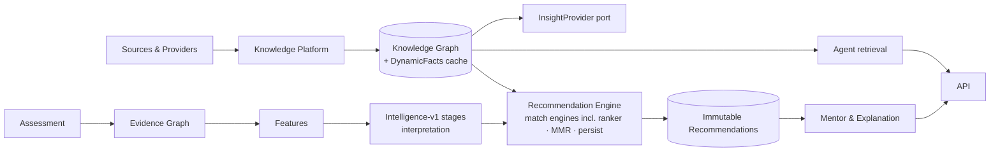

# Chapter 8 — The Consolidated Design Review

This chapter is the internal design review the mandate demanded: the verdict
on the system as built, the complete ranked findings register, the superior
designs with rationale and trade-offs, the resulting **target architecture**,
and a migration plan that preserves the constitution throughout.

## 8.1 Overall verdict

**The architecture is right; the implementations inside it are staged.**
The three structural bets — a zero-dependency immutable domain, one engine
contract with a deterministic boundary, and a generate/validate knowledge
platform as the single source of truth — are correct and would survive a
decade of evolution. The system's weaknesses are of two kinds, and the
distinction matters:

1. **Deliberate scaffolding** honestly playing its role behind real ports:
   in-memory persistence, linear graph scans, the 12-item instrument, keyword
   heuristics, absent auth. These are *adapter/data upgrades*, not redesigns —
   the strongest evidence the architecture is good is that none of the P0/P1
   fixes below require changing a domain type or an engine contract.
2. **Genuine design defects** the architecture does not excuse: the duplicated
   reasoning stack (E-1), the parallel knowledge stores (W-2/A-2), dead
   ranking dimensions (E-3), and the missing privacy constitution (C-1).
   These are decision debts, and this review's job is to retire them.

## 8.2 The findings register (complete, ranked)

**P0 — gates any real user**

| ID | Finding | Resolution |
|----|---------|-----------|
| W-4 | No authentication/authorization | OIDC + service-layer ownership checks (Ch. 6 §6.5) |
| C-1/D-6 | No privacy/consent architecture for minors' psychometric data | Art. XI/XII; `Consent` aggregate; erasure/export use cases (Ch. 7 §7.5) |
| O-1 | All state in-memory | Postgres adapters + outbox (Ch. 7 §7.2) |

**P1 — correctness & coherence of the intelligence product**

| ID | Finding | Resolution |
|----|---------|-----------|
| E-1 | Two parallel reasoning stacks | One pipeline: Intelligence-v1 stages as interpretation; P2 RecommendationEngine as the only decision layer; ranker becomes a MatchEngine (Ch. 4 §4.8) |
| W-2 / A-2 / M-3 | Three knowledge stores (seed nodes, insights dict, Knowledge Platform) | Platform becomes the only source: `InsightProvider` port; agent retrieval reads the graph; careers ingested via generation |
| E-2 / E-3 | Skill-match gate; dead dimensions with live weights | Graph-based per-skill matching; implement or zero style/constraint weights |
| K-1 | O(N) graph access | Indexed in-memory adapter now; graph DB later, same port |
| K-2 | Token-overlap recall ceiling | Alias expansion → BM25 → vector supplement (ordered) |
| K-3 / O-2 | No background execution | Worker + schedule for generate/enrich |
| W-3 / A-6 | Recommendations recomputed, never persisted | POST persists immutable aggregate; GET reads |
| A-3 | Knowledge platform unexposed | `/api/v1/knowledge/*` |
| A-5 | Report XSS | Escape interpolations |
| O-3 / O-4 | No analytics sink; no log/metric export | Event subscriber; JSON logs + Prometheus text |
| E-4 | Demo instrument beneath claims | IRT item bank behind the same contract |

**P2 — quality, scale-triggered, hygiene** (analysis in chapters): C-2, C-3,
D-2, D-3, D-4, A-1, A-4, E-5, E-6, E-7/W-1, K-4…K-8, O-5, O-6.
**P3:** C-4 naming, D-1, D-5, OTel.

## 8.3 The three cross-cutting superior designs

**1. One truth, one reasoner (E-1 + knowledge unification).**
Today knowledge lives in three places and fit-scoring in two. Target:

*Why this shape:* every product surface becomes a view over two stores (graph
+ recommendations), version-pinned and reproducible; the mentor stops
depending on a seed dict; discovery/coach/cards can never disagree about a
salary again. *Trade-off:* a real refactor (~the largest single work item in
this review) — but every seam it moves along is an existing contract.

**2. Retrieval as a ladder, not a leap (K-2/E-5/K-8).** Resist jumping to a
vector database. The ladder — graph aliases → BM25 → embeddings-as-supplement
— keeps each rung explainable, cheap, and constitutionally compliant
(vectors never override canonical knowledge), and each rung's win is
measurable in the eval harness (O-6) before the next is bought.

**3. Honest numbers end-to-end (E-4/E-6/C-2).** The chain "2-item constructs
→ heuristic blend confidence → 87.3% compatibility" launders uncertainty into
false precision. Target: calibrated instrument (IRT) → posterior-variance
confidence → banded scores with intervals in the UI, and a calibration
dashboard fed by the analytics sink. This is the difference between a toy
that looks scientific and a product that is.

## 8.4 Migration plan (constitution-preserving order)

1. **M0 (safety):** A-5 escape; E-3 zero dead weights; C-3 constitution
   checks in CI. *Days.*
2. **M1 (real users):** OIDC + consent aggregate + Postgres adapters + outbox
   + logs/metrics. *The infrastructure sprint; no domain changes.*
3. **M2 (one truth):** InsightProvider port; agent reads the graph; careers
   via generation; knowledge REST routes; worker + schedules; analytics
   subscriber.
4. **M3 (one reasoner):** ranker → MatchEngine; live path through
   RecommendationEngine; persist recommendations; matches cache.
5. **M4 (honest numbers):** item bank + IRT; posterior confidence; banded UI;
   eval harness gating CI.
6. **M5 (scale-triggered, as needed):** indexed→graph-DB adapter; BM25→vector
   rungs; Redis cache; blocking-based resolution.

Each stage ships green: the 82-test suite plus per-stage tests run unchanged
throughout because every migration moves along a port or a payload, never
through a contract.
